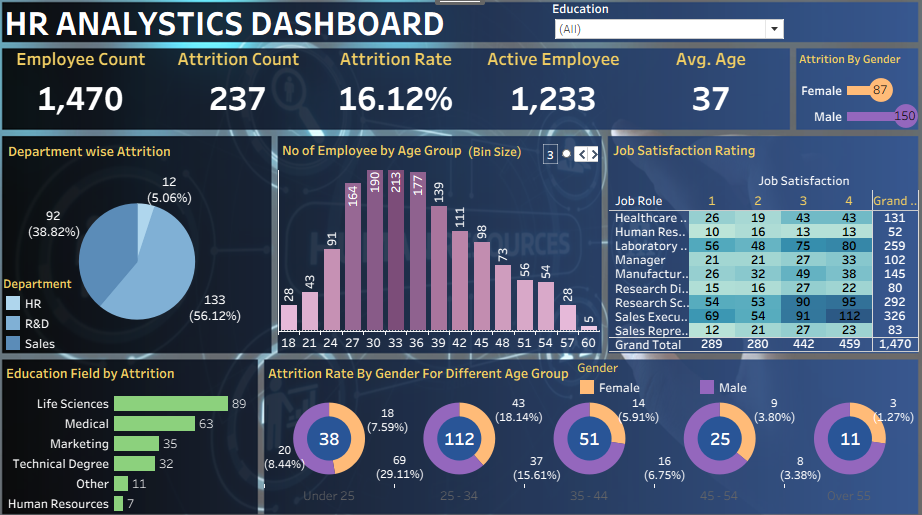

HR Employee Attrition Analysis & Dashboard

📌 Project Overview

Employee attrition is a major challenge for organizations because it affects productivity, hiring costs, and workforce stability.

In this project, I analyzed HR employee data using Python and Tableau to identify patterns behind employee turnover. The project covers data cleaning, exploratory data analysis (EDA), statistical analysis, data visualization, and dashboard development.

The goal was to transform raw HR data into meaningful insights that can help organizations improve employee retention and workforce planning.

---

🎯 Business Problem

Organizations often struggle to understand why employees leave.

This project aims to answer questions such as:

* Which departments have the highest attrition?
* Does job satisfaction impact employee retention?
* Which age groups are more likely to leave?
* How do work-life balance and experience affect attrition?

---

🛠 Tools & Technologies

* Python
* Pandas
* NumPy
* Matplotlib
* Seaborn
* Tableau
* Microsoft Excel
* Jupyter Notebook

---

📂 Project Workflow

1. Data Collection

* Imported HR employee dataset
* Reviewed dataset structure and columns

2. Data Cleaning

* Checked missing values
* Checked duplicate records
* Verified data types
* Prepared clean dataset for analysis

3. Exploratory Data Analysis (EDA)

Performed:

* Dataset Information Analysis
* Descriptive Statistics
* Mean, Median, Standard Deviation
* Correlation Analysis
* Employee Demographics Analysis

4. Data Visualization

Created:

* Histograms
* Scatter Plots
* Box Plots
* Regression Plots
* Heatmaps
* Pairplots

5. Outlier Detection

Applied:

* IQR Method
* Z-Score Method

6. Dashboard Development

Built an interactive Tableau dashboard featuring:

* Employee Count
* Active Employees
* Attrition Count
* Attrition Rate
* Average Age
* Department-wise Attrition
* Job Satisfaction Analysis
* Gender-wise Attrition
* Education Field Analysis
* Age Group Analysis

---

📊 Dashboard Preview

---

🔍 Key Insights

* Employee attrition rate was approximately 16%.
* Certain departments experienced higher turnover.
* Job satisfaction showed a relationship with attrition.
* Employee demographics helped identify retention patterns.
* Interactive visualizations improved workforce analysis.

---

📁 Project Structure

HR-Employee-Attrition-Analysis

├── README.md

├── HR_Analytics.ipynb

├── HR_Data.xlsx

├── dashboard_screenshot.png

└── HR_Analytics_Dashboard.twb

---

🚀 Skills Demonstrated

* Data Cleaning
* Exploratory Data Analysis (EDA)
* Statistical Analysis
* Data Visualization
* Tableau Dashboard Development
* Business Insight Generation
* Reporting & Analytics

---

👨‍💻 Author

Anas 

BCA Graduate (71% - First Division)

Skills

Python | SQL | Excel | Tableau | Pandas | NumPy | Data Visualization

LinkedIn

https://www.linkedin.com/in/anassaifi

GitHub

https://github.com/Anasbca01
